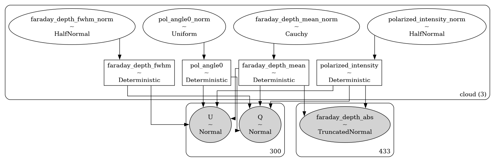

# bayes_pol <!-- omit in toc -->


[](https://bayes-pol.readthedocs.io/en/latest/?badge=latest)
[](https://codecov.io/gh/tvwenger/bayes_pol)

Bayesian Spectral Polarization Models

`bayes_pol` implements models to infer the physics of the interstellar medium from radio continuum polarization observations.

- [Installation](#installation)
  - [Basic Installation](#basic-installation)
  - [Development installation](#development-installation)
- [Models](#models)
  - [`FaradayModel`](#faradaymodel)
- [Syntax \& Examples](#syntax--examples)
- [Issues and Contributing](#issues-and-contributing)
- [License and Copyright](#license-and-copyright)


# Installation

## Basic Installation

Install with `pip` in a `conda` virtual environment:
```
conda create --name bayes_pol -c conda-forge pymc>=5.20 pip
conda activate bayes_pol
pip install bayes_pol
```

## Development installation
Alternatively, download and unpack the [latest release](https://github.com/tvwenger/bayes_pol/releases/latest), or [fork the repository](https://docs.github.com/en/pull-requests/collaborating-with-pull-requests/working-with-forks/fork-a-repo) and contribute to the development of `bayes_pol`!

Install in a `conda` virtual environment:
```
conda env create -f environment.yml
conda activate bayes_pol-dev
pip install -e .
```

# Models

The models provided by `bayes_pol` are implemented in the [`bayes_spec`](https://github.com/tvwenger/bayes_spec) framework. `bayes_spec` assumes that the source of the polarization signal can be decomposed into a series of "clouds" with Gaussian-like Faraday depth distributions, each of which is defined by a set of model parameters. Here we describe the models available in `bayes_pol`.

## `FaradayModel`

The `FaradayModel` predicts observations of Stokes Q, U, and Faraday depth (the Fourier transform of the complex polarization) by assuming the polarized intensity is modified by a series of "clouds" in Faraday depth space. The following diagram demonstrates the relationship between the free parameters (empty ellipses), deterministic quantities (rectangles), model predictions (filled ellipses), and observations (filled, round rectangles). Many of the parameters are internally normalized (and thus have names like `_norm`). The subsequent tables describe the model parameters in more detail.



| Cloud Parameter<br>`variable` | Parameter                           | Units           | Prior, where<br>($p_0, p_1, \dots$) = `prior_{variable}`     | Default<br>`prior_{variable}` |
| :---------------------------- | :---------------------------------- | :-------------- | :----------------------------------------------------------- | :---------------------------- |
| `polarized_intensity`         | Polarized intensity                 | data brightness | $P_I \sim {\rm HalfNormal}(\sigma=p)$                        | `100.0`                       |
| `faraday_depth_mean`          | Mean Faraday depth                  | `rad/m2`        | $\langle F \rangle \sim {\rm Cauchy}(\alpha=p_0, \beta=p_1)$ | `[0.0, 1000.0]`               |
| `faraday_depth_fwhm`          | Faraday depth FWHM                  | `rad/m2`        | $\Delta F \sim {\rm HalfNormal}(\sigma=p)$                   | `10.0`                        |
| `pol_angle0`                  | Polarization angle at $\lambda = 0$ | `rad`           | $\phi_0 \sim {\rm Uniform}(-\pi/2, \pi/2)$                   |                               |  |

# Syntax & Examples

See the various tutorial notebooks under [docs/source/notebooks](https://github.com/tvwenger/bayes_pol/tree/main/docs/source/notebooks). Tutorials and the full API are available here: https://bayes-pol.readthedocs.io.

# Issues and Contributing

Anyone is welcome to submit issues or contribute to the development
of this software via [Github](https://github.com/tvwenger/bayes_pol).

# License and Copyright

Copyright(C) 2025 by Trey V. Wenger

This code is licensed under MIT license (see LICENSE for details)